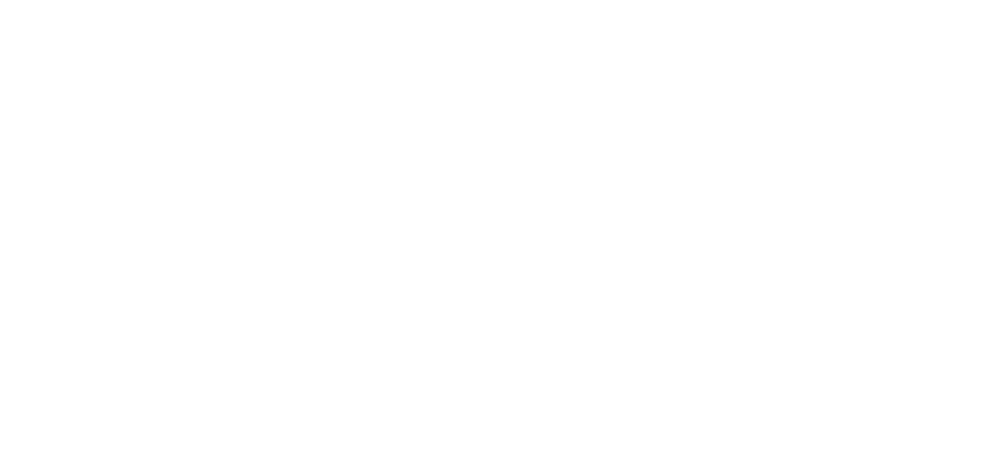

    

Heyo, I'm BLOK. I'm an experimental heavy EDM/IDM artist. In other words, I make atrocious music. (:

I also have interests in visual arts and gaming. I've dabbled into programming languages such as C#, GDScript, and Java.

If you wish to collaborate or are seeking assistance for a project, feel free to contact me at wherever is convenient for you:

<ul>
  <li>Discord: @blokbustr</li>
  <li>𝕏: <a href="https://x.com/blokbustrmusic">@blokbustrmusic</a> </li>
  <li>Instagram: <a href="https://www.instagram.com/blokbustr_music">@blokbustr_music</a> </li>
</ul>

Do know, however, that my availability is limited. I'm not adept with code yet, but I can certainly provide music, sounds, art and any other kind of assets.

Here is some of the software I primarily use:

<ul>
  <li>🎵 <a href="https://www.apple.com/logic-pro/">Logic Pro</a></li>
  <li>🎨 <a href="https://www.blender.org/">Blender</a> / <a href="https://procreate.com/">Procreate</a></li>
  <li>📄 <a href="https://www.jetbrains.com/idea/">IntelliJ IDEA CE</a> / <a href="https://vscodium.com/">VSCodium</a> </li>
  <li>🎮 <a href="https://getwhisky.app/">Whisky</a></li>
</ul>

T̴̈́͠h̵͛̒e̶̍̓ ̷̘́w̶̉͝o̵̊͘l̶̈́ves do not seek ̵̊͊f̶̺͂o̴rg̵͘ive̴ness;

they̡ ̸̼̾h̷̿̓ù̵̆n̸͑ger for v̉en̤g̶͆̆eanc̈́͋e.

